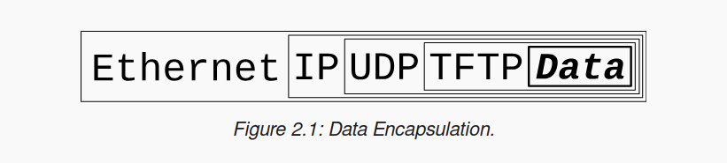

[Source](https://beej.us/guide/bgnet/html/split/what-is-a-socket.html)
# What is a socket?

a way to speak to other programs using standard Unix file descriptors

"**Everything in Unix is a file!**" -?> include network connection, terminal, a real on-the-disk file...

# Two types (base) of Internet Sockets
## Stream Sockets - arrives and error-free
## Datagram Sockets - connections less

# Network theory



When another computer receives the packet, the hardware strips the Ethernet header, the kernel strips the IP and UDP headers, the TFTP program strips the TFTP header, and it finally has the data.

# IP addr
## Subnets
### Netmask
- A 
- B 
- C 
- Bitwise-AND with the IP address
## Port Numbers
- Differents services on the Internet have different well-known port Numbers
- Check on ```bash etc/services```
## Byte Order
- Short 2 bytes
- Long 4 bytes
- Big-Endian (Network Byte Order), Little-Endian
